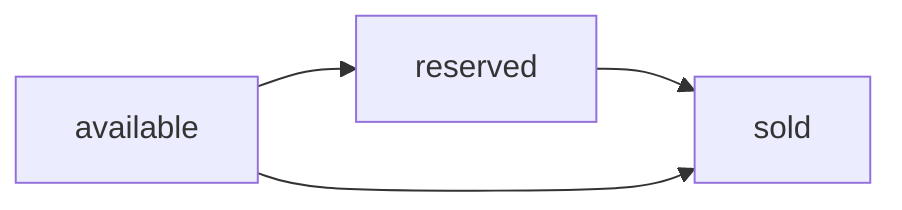

Listings are the core of TruequeU. Each listing represents an item a student wants to sell or trade with their campus community. You can browse all available listings, view details, contact the seller, or manage your own posts.

## Listing fields

Every listing contains the following information:

| Field | Type | Description |
|---|---|---|
| `id` | `string` | Unique identifier for the listing |
| `title` | `string` | Name of the item |
| `description` | `string` | Full details about the item |
| `price` | `number` | Asking price in local currency |
| `category` | `string` | Item category (e.g. Books, Electronics) |
| `status` | `ListingStatus` | Current state: `available`, `reserved`, or `sold` |
| `images` | `string[]` | Array of image URLs for the item |
| `ownerId` | `string` | ID of the user who created the listing |
| `isFavorite` | `boolean` | Whether the current user has favorited this listing |

## Browsing listings

Navigate to `/listings` to see all listings — both the built-in seed data and items posted by users.

**Search** — Use the search bar at the top of the page to filter listings by title in real time. The query is stored in the Zustand store via `setSearchQuery` and applied as you type.

### Listing card

Each listing appears as a card showing:

- **Image** — the first photo in the listing's `images` array
- **Title** — the item name
- **Price** — the asking price
- **Category** — the item category
- **Status badge** — color-coded badge indicating `available`, `reserved`, or `sold`
- **Favorite toggle** — heart icon to save the listing (see [Favorites](/features/favorites))

## Listing detail view

Click any listing card to open the full detail page at `/listings/:id`. This page shows:

- All listing images
- Full title and description
- Price, category, and current status
- Seller information

### Contacting the seller

If you are logged in and you are **not** the listing owner, a **Contact Seller** button is displayed. Clicking it creates or opens a chat thread tied to that listing and redirects you to `/chat`.

<Note>You must be signed in to contact a seller. If you are not logged in, you will be prompted to sign in first.</Note>

### Managing your own listing

If you are the listing owner, the **Contact Seller** button is replaced with status controls. You can update the listing status directly from the detail page.

<Warning>Only the listing owner can change the status. Buyers and other users cannot modify it.</Warning>

## Status workflow

Listings move through three states:

<Columns cols={3}>
  <Card title="Available" icon="circle" color="#22C55E">
    The item is listed and open for buyers to contact the seller.
  </Card>
  <Card title="Reserved" icon="clock" color="#F59E0B">
    The seller is in talks with a buyer. The item is tentatively held.
  </Card>
  <Card title="Sold" icon="circle-check" color="#6B7280">
    The transaction is complete. The listing is closed.
  </Card>
</Columns>

Status is updated by calling `updateStatus(id, status)` in the store. Only the listing owner sees the controls to do this.

## Creating a listing

To post a new item, go to your [Profile](/features/profile) and click **+ New Listing**, or follow the [Creating a listing](/guides/creating-a-listing) guide.
